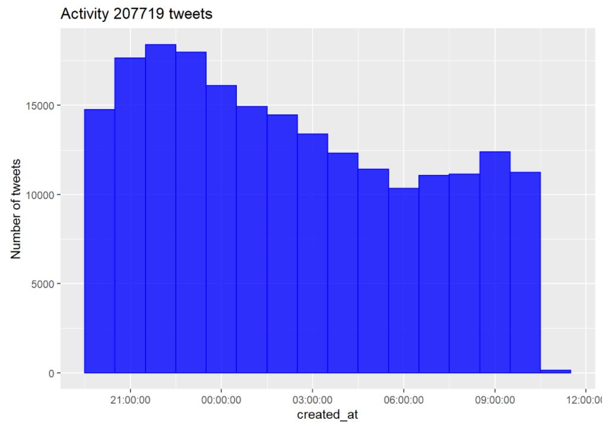
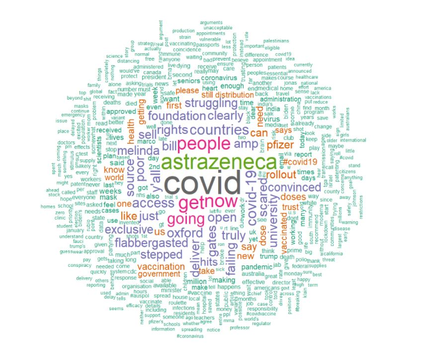
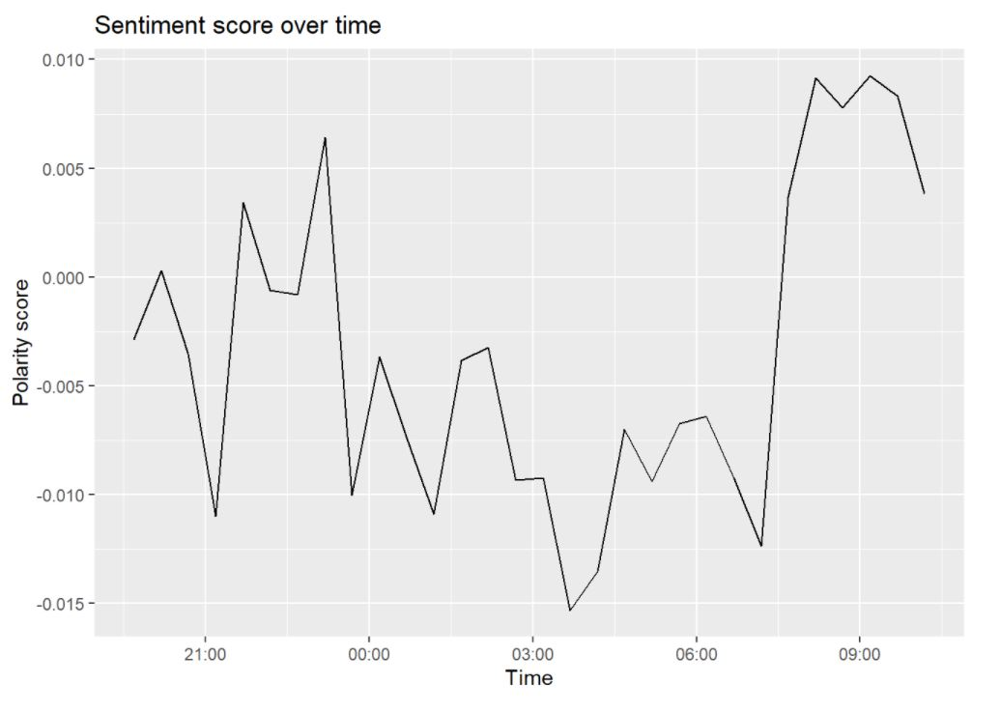
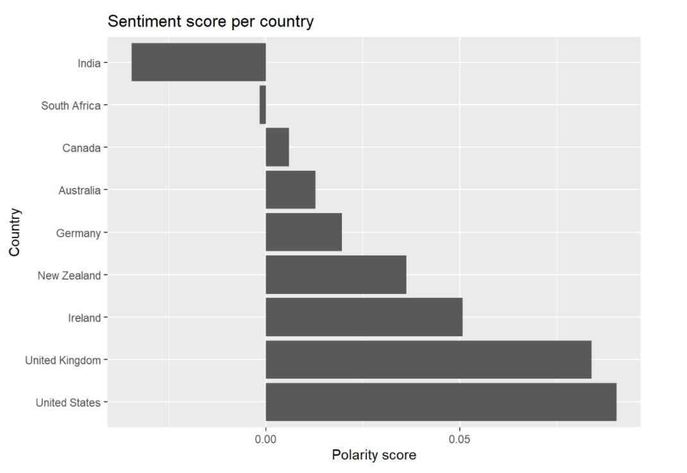
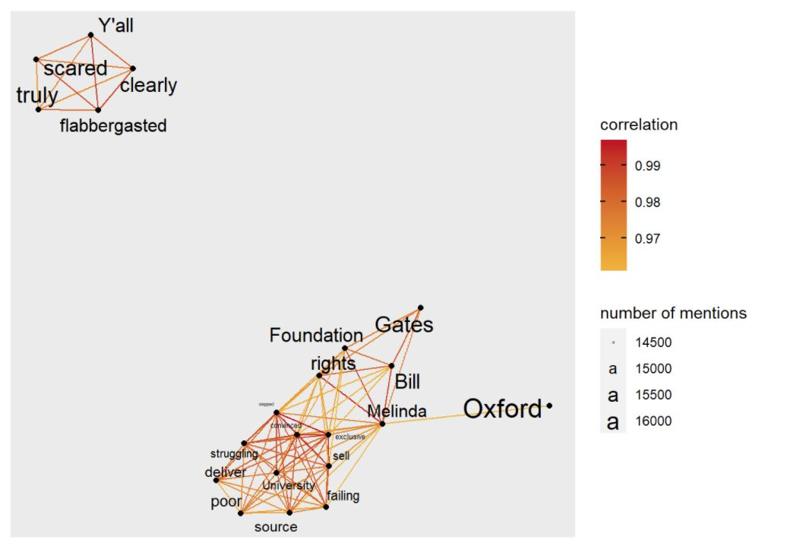
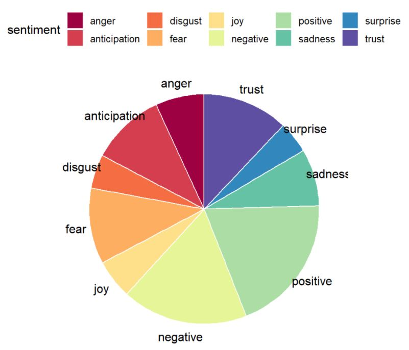

# Public opinion analysis Covid 19 vaccine
## Social Media Analytics project using R 

The aim of this project is to analyze the global sentiment of the public towards the Covid-19 vaccine through the examination of tweets.
We scrapped 207719 English-language tweets containing the word ‘vaccine’, sent between the 24th and 25th of January 2021. 

## Summary of the project 

### Text Analysis 

After tokenizing the tweets, removing the punctuation & stop words, we were able to visualize the most frequent used terms.

### Sentiment Analysis 

We observed the sentiment score variation over time, and noticed a small fluctuation around 0 throughout the studied period.
The score was at its lowest at nightime. 

We also compared sentiment scores among countries where the tweets originated from.

Western countries have a rather positive polarity score, while India and South Africa seem to have a negative sentiment toward the vaccine. 

### Network of Words

One thing we can notice in those words that are often combined together is the pairing of "deliver" and "struggling". It might represent the concerns of the public with the distribution of the vaccine. 

### Sentiment Analysis Based on Emotions

Using the nrc dictionnary, we were able to determine the sentiments emerging from the tweets. 

Overall the public opinion towards the vaccine is slightly negative, but that sentiment is not overwhelming. It would be interesting to check how this tendency is evolving when the delivery of the vaccine will be more favorable.

