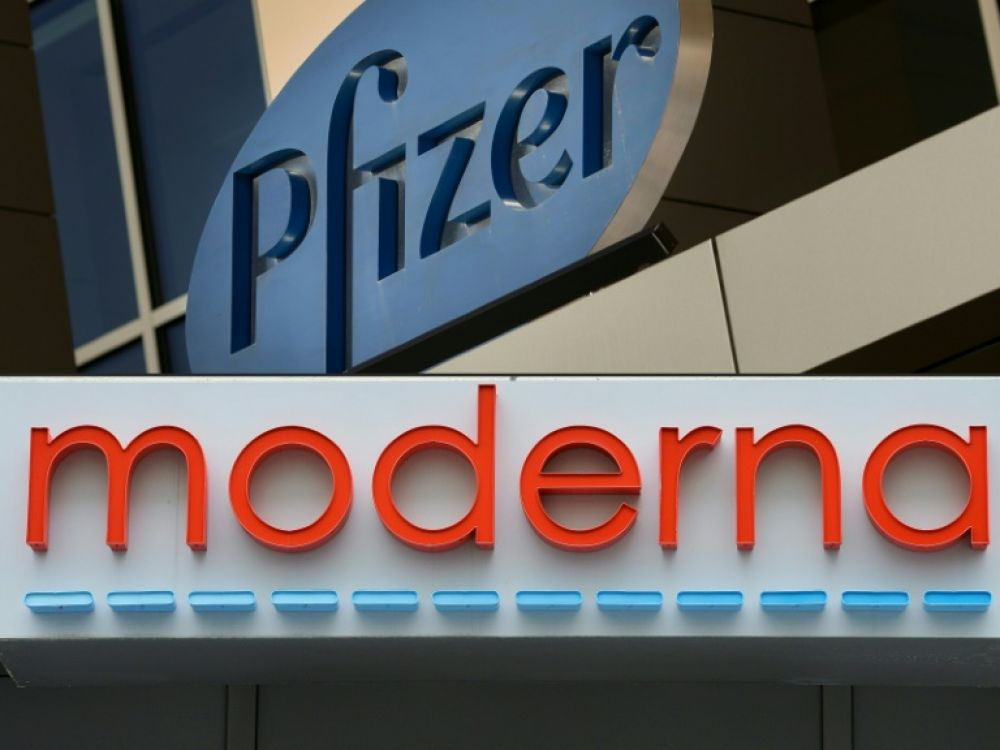

## Business question

Scientists of the biopharmaceutical industry and governments have acted with unprecedented velocity to develop a vaccine against the Covid-19 pandemic.

This drug has become a huge challenge both in terms of public health and for the economy. For example the US administration gave over $11 billion in funding through the “Operation Warp Speed”, intended for seven different vaccine candidates. 
Authorizations of market deployments have been yet granted to 5 vaccines from different pharmaceutical companies, among them Pfizer-BioNTech, Moderna or AstraZeneca (University of Oxford). 

Despite the stakes, public opinion on this vaccine is very diverse, which is why we decided to carry out a global analysis of public opinion in different countries around the world on Twitter.




Therefore, we scraped 207719 English-language tweets containing the word 'vaccine' to analyse public opinion.

```{r message=FALSE}
library(rtweet)
library(quanteda)
library(tidyverse)
library(ggplot2)
library(topicmodels)
library(tidytext)
library(dplyr)
library(sentimentr)
library(widyr)
library(ggraph)
library(igraph)
library(ggpubr)
```

## Tweets scraping and creation of the dataframe

```{r}
query <- "vaccine OR VACCINE OR Vaccine" 
```

```{r load myData, include=FALSE}
load("tweets_vaccine.RData")
tweets_vaccine.df <- tweets_covid.df
```
```{r eval=FALSE}
tweets_vaccine.df <- search_tweets(
  query,
  n = 200000,
  type = "recent",
  include_rts = TRUE,
  geocode = NULL,
  max_id = NULL,
  parse = TRUE,
  token = NULL,
  retryonratelimit = TRUE,
  verbose = TRUE,
  lang = "en",
  tweet_mode = "extended"
)
```
```{r}
print(nrow(tweets_vaccine.df))

```

The dataframe resulting from the scraping has a number of rows equivalent to the number of tweets and the number of columns representing a set of 90 variables for each tweet. We have thus selected only the variables of most interest to us.

```{r}
selected_columns <- c(1,3:6,12:14,17,67,68)
print(colnames(tweets_vaccine.df[,selected_columns]))
```

We insert the sub-dataset into a corpus in order to collect meta-data on the text of the tweets: sentences (the number of sentences in the tweet), tokens (the number of words and punctuation marks in the tweet) and
types (the number of words in the tweet).

```{r}
corp_twitter <- quanteda::corpus(tweets_vaccine.df[,selected_columns], text_field = "text")
summary(corp_twitter, n=5)
texts(corp_twitter)[1:5]
tokens(texts(corp_twitter[1:5]))
summary.corpus <- summary(corp_twitter, n=nrow(tweets_vaccine.df))
```

## Time range analysis
Using the variable 'created_at', we observe the trend in the amount of tweets about the vaccine over the 15 hours in which we extracted the tweets.

```{r}
first_tweet <- head(tweets_vaccine.df[order(tweets_vaccine.df$created_at),], n=1)
first_tweet$created_at
last_tweet <- tail(tweets_vaccine.df[order(tweets_vaccine.df$created_at),], n=1)
last_tweet$created_at
```

The first tweet extracted is from 24 January at 7:41pm  while the last one is from 25 January at 10:30am.

```{r}
ggplot(summary.corpus, aes(x=created_at)) +
  geom_histogram(aes(y=..count..), 
                 binwidth=3600,
                 colour="blue",
                 fill="blue", 
                 alpha=0.8) +
  ggtitle(paste0("Activity ",nrow(tweets_vaccine.df)," tweets")) +
  scale_y_continuous(name="Number of tweets") + 
  scale_x_datetime(date_labels = "%H:%M:%S", breaks = scales::pretty_breaks(8))
```

Considering the European time of France, there seems to be a higher concentration of tweets during the evening/night than in the morning: this can probably be explained by the fact that, as the tweets are extracted in English, most of the tweets come from the USA, so when it is night in France, it is afternoon/evening there.

## Twitter text analysis

To analyse the text of each tweet, we separate all the words by removing numbers, punctuation, symbols, separators, tags and urls.

```{r warning = FALSE}
word_tweets <- tokens(corp_twitter,
                     what="word",
                     remove_numbers=TRUE,
                     remove_punct=TRUE,
                     remove_symbols=TRUE,
                     remove_separators=TRUE,
                     remove_url=TRUE)
head(word_tweets,n=2)
```

We use the English stopwords dictionary to eliminate words that are useless for our analysis. 

```{r}
word_tweets <- tokens_remove(word_tweets,stopwords(language = "en"))
head(word_tweets,n=2)
```

We remove other words that are very frequent but are not useful for our analysis (including the word vaccine which would otherwise be the one with the highest frequency).

```{r}
words_to_remove <- c('vaccine','vaccin','vaccines')
```

We build a sparse document-feature matrix useful for calculating the frequency of terms within tweets.

```{r}
dfmat_corp_twitter <- dfm(word_tweets,remove = words_to_remove,
                          stem = FALSE, remove_punct = TRUE, remove_url=TRUE)
dfFreq <- textstat_frequency(dfmat_corp_twitter)
```

We print the 40 most frequently used words with their relative frequency, sorting them by frequency in the second graph.

```{r}
ggplot(dfFreq[1:40,], aes(x=feature, y=frequency)) + 
  geom_col() +
  coord_flip() +
  labs(x = "Word", y = "Count") +
  theme_minimal()
```


```{r warning = FALSE}
ggplot(dfFreq[1:40,], aes(x=reorder(feature, -rank), y=frequency)) + 
  geom_col() +
  coord_flip() +
  labs(x = "Word", y = "Count") +
  theme_minimal()
```

We notice that the most frequently used word is obviously covid, since the vaccine we are talking about nowadays is related to covid.
There are also the names of the main pharmaceutical companies involved in the vaccine race: in addition to the well known Pfitzer-Biontech, whose vaccine has already been approved, there is Astrazeneca on the top, whose vaccine is in the approval phase.
There are also the names of Bill and Melinda Gates, who through their foundation have donated a lot of money in the vaccine race.
All other words are related to the vaccine, so there were no surprises in this analysis.

We print the most used words also in wordcloud form.

```{r}
textplot_wordcloud(dfmat_corp_twitter, min_count = 6, random_order = FALSE,
                   rotation = .25,
                   color = RColorBrewer::brewer.pal(8, "Dark2"))
```

Let us analyse the difference between word frequency and frequency of tweets in which words are present.

```{r}
dfFreq_long_top <- tidyr::gather(
  dfFreq[1:40,],
  key = "key",
  value = "value",
  c("frequency","docfreq"),
  na.rm = FALSE,
  convert = FALSE,
  factor_key = FALSE
)
ggplot(dfFreq_long_top, aes(x=reorder(feature, -rank), y=value, fill = key)) + 
  geom_bar(position="dodge", stat="identity") +
  scale_x_discrete(breaks = dfFreq_long_top[1:40,"feature"]) + 
  labs(x = "Words", y = "Count") +
  coord_flip() +
  theme_minimal()

```

We note that most of the words are used only once in each tweet, except for "covid", "astrazeneca", "get" and "say".
The pharmaceutical company Astrazeneca is even mentioned almost twice per tweet, in tweets where it is mentioned.

Let's try to count two words as if they were a token and not just one, this way we can count the frequency of neighbouring word pairs in tweets.

```{r warning = FALSE}
dfm2 <- dfm(tokens_ngrams(word_tweets,n=2))
dfFreq2 <- textstat_frequency(dfm2)
ggplot(dfFreq2[1:40,], aes(x=reorder(feature, frequency), y=frequency)) + 
  geom_col() +
  labs(x = "Words", y = "Count") +
  coord_flip() +
  theme_minimal() 

```

In addition to the results already identified above with the one-word tokens, there is a notable presence of tweets about poorer nations struggling to get enough doses of the vaccine and another notable presence of tweets that seem to convey fear and lack of confidence in the covid 19 vaccine.

## Topic modeling

We use topic modeling to discover of hidden semantic structures in a text body. Every document is a mixture of topic and every topic is a mix of words.
We decided to group the tweets into two different groups using the LDA (Latent Dirichlet Allocation) algorithm which builds a topic per document model and words per topic model, modeled as Dirichlet distributions.

```{r}
set.seed(1234)
dtm <- convert(dfmat_corp_twitter, to = "topicmodels")
lda2 <- LDA(dtm, k = 2, control = list(seed=1234))
terms(lda2, 10)
```

```{r}
topics<-tidy(lda2, matrix = "beta")
topics %>%
  group_by(topic) %>%
  top_n(10, beta) %>%
  ungroup() %>%
  arrange(topic, -beta) %>%
  ggplot(aes(reorder(term, beta),beta,fill=factor(topic)))+
  geom_col(show.legend = FALSE) +
  facet_wrap(~ topic, scales = "free") +
  scale_fill_viridis_d() +
  coord_flip() +
  labs(x = "Topic",
       y = "beta score",
       title = "Topic modeling")
```

The first argument is mainly about the Oxford-Astrazeneca vaccine: a vaccine with very high efficacy recently developed by the British company, which can be stored in a normal fridge, is easier to distribute in different countries and therefore more accessible. The vaccine has also been publicly endorsed by Bill Gates, which is why his name is often present in this group of tweets.

The second argument is more general and more difficult to interpret: it probably gathers more subjective, more varied and less scientifically based opinions about the different vaccines against covid 19. We will analyse these opinions in the next part with sentiment analysis.

## Sentiment analysis

We perform a sentiment analysis on tweets to see what the public opinion is about the vaccine.
First we do a sentiment analysis per sentence: i.e. each tweet is divided into sentences and the sentiment score is calculated for each one and finally we do the global average.

```{r}
tweets_sentiment.df <- tweets_vaccine.df[,selected_columns]
sentiment_by_sentence <- sentiment(get_sentences(tweets_sentiment.df$text))
sentiment_by_sentence
average_sentiment_by_sentence <- mean(sentiment_by_sentence$sentiment)
standard_deviation_sentiment_by_sentence <- sd(sentiment_by_sentence$sentiment)
average_sentiment_by_sentence
standard_deviation_sentiment_by_sentence
```
The average sentiment score per sentence is -0.003, which means that the general opinion about the vaccine is very stable (slightly negative): although there may be negative opinions, there are just as many positive ones.
The standard deviation of the sentiment score is

Let us now analyse the evolution of the sentiment score over the 15 hours in which the tweets were extracted.
```{r warning = FALSE}
tweets_sentiment.df$created_at <-  tweets_sentiment.df$created_at %>% as.POSIXct
tweets_sentiment.df$roundTime <- as.POSIXct(cut(tweets_sentiment.df$created_at, breaks = "30 mins"))
tweets_sentiment_group <- tweets_sentiment.df %>% group_by(roundTime) %>% group_split()
sentiment_by_time <- data.frame('time'=1:length(tweets_sentiment_group),
                                'polarity_score'=rep(0,length(tweets_sentiment_group))
)
for (i in 1:length(tweets_sentiment_group)) {
  sentiment_by_time$polarity_score[i] <- 
    sentiment(tweets_sentiment_group[[i]]$text) %>% 
    select("sentiment") %>% unlist %>% mean
}
sentiment_by_time$time <- as.POSIXct(levels(factor(tweets_sentiment.df$roundTime)))
ggplot(sentiment_by_time, aes(x = time, y = polarity_score)) +
  geom_line() +
labs(x = "Time", y = "Polarity score", title = "Sentiment score over time")
```

The curve is very unstable around zero, there is no clear pattern other than the fact that overnight the sentiment score is a little lower than in the morning.

We now want to perform a country-by-country sentiment score analysis to understand how different countries around the world have reacted to the vaccine. We therefore only select tweets that have the location of the country.

```{r}
tweets_vaccine_with_country.df <- subset(tweets_vaccine.df,!is.na(country),selected_columns)
tweets_vaccine_with_country.df <- subset(tweets_vaccine.df,country!="",selected_columns)
nrow(tweets_vaccine_with_country.df)
unique(tweets_vaccine_with_country.df$country)
```

There are 1157 tweets and 49 countries. We analyse only the country with at least 10 tweets.

```{r}
tweets_vaccine_with_country_count.df <- tweets_vaccine_with_country.df %>% count(country, sort=TRUE)  %>% filter(n>7)
tweets_vaccine_with_country.df <- tweets_vaccine_with_country.df %>% filter(country %in% tweets_vaccine_with_country_count.df$country)
```


```{r}
tweets_vaccine_with_country_count.df %>% na.omit() %>% 
mutate(country=reorder(country,n)) %>%ggplot(aes(x=country,y=n))+
geom_bar(stat="identity")+geom_col()+coord_flip() +
labs(x = "Country", y = "Count",
title = "Tweets per country") +
theme_light()
```

Obviously, the countries with the most tweets (at least 7) are the English-speaking ones and Germany as we only selected tweets in English. 

```{r}
sentiment_country_by_sentence <- sentiment(get_sentences(tweets_vaccine_with_country.df$text))
sentiment_country_by_sentence
tweets_sentiment_country_group <- tweets_vaccine_with_country.df %>% group_by(country) %>% group_split()
sentiment_by_country <- data.frame('country'=unique(tweets_vaccine_with_country.df$country),
                                'polarity_score'=rep(0,length(tweets_sentiment_country_group)))
for (i in 1:length(tweets_sentiment_country_group)) {
  sentiment_by_country$polarity_score[i] <- 
    sentiment(tweets_sentiment_country_group[[i]]$text) %>% 
    select("sentiment") %>% unlist %>% mean
}
ggplot(sentiment_by_country, aes(x = reorder(country, -polarity_score), y = polarity_score)) +
  geom_col() +
  coord_flip() +
  labs(x = "Country", y = "Polarity score", title = "Sentiment score per country")
```

The sentiment score of the English-speaking countries does not surprise us: Western countries such as the USA and the UK have the highest score, while the only countries with a negative score are India and South Africa, where the vaccine doses are probably taking a long time to arrive.

## Word network plot 

```{r message=FALSE}
library(plyr)
```


To analyze word combinations among tweets, we will start by using the word_tweets token. 
It contains all separates words from tweets, cleaned from punctuation and stop words.
We transform this token to a data frame, and rename the columns.

```{r}
word_tweets_df <- ldply (word_tweets, data.frame)
colnames(word_tweets_df)=c("tweet","word")
word_tweets_df <- distinct(word_tweets_df)
```

We then filter the words mentioned to only keep the ones occurring more than 10000 times.
```{r}
users_who_mention_word <- word_tweets_df %>%
  dplyr::count(word) %>%
  filter(n >= 10000) 
```

We now proceed to the calculation of the correlation between words (how much they are paired together).
We are only keeping the really high correlation scores due to the great number of observations, as we want explicit results from our graph.

```{r warning = FALSE}
word_correlations <- word_tweets_df %>%
  semi_join(users_who_mention_word, by = "word") %>%
  pairwise_cor(item = word, feature = tweet) %>%
  filter(correlation >= 0.96)
```

We finally create a word network plot, presenting the correlation and number of mentions of words.

```{r}
graph_from_data_frame(d = word_correlations,
                      vertices = users_who_mention_word %>%
                        semi_join(word_correlations, by = c("word" = "item2"))) %>%
  ggraph(layout = 'fr') +
  geom_edge_link(aes(color = correlation)) +
  scale_edge_colour_gradient(low = "#F0B83C", high = "#BC1024")+
  geom_node_point() +
  geom_node_text(aes(size = n, label = name), repel = TRUE) +
  scale_size_continuous( name = "number of mentions")
```


Words that appear frequently paired together are the mention of the Bill and Melinda Gates' Foundation. They indeed allocated some $1.75 billion to help the development and distribution of the vaccine, especially for poor countries, and that must have been a vast subject of discussion on the social network.

Also we can observe that "deliver" is often paired with "failing" and "struggling", which might represent the feeling of the public towards the vaccine distribution that is subject to questioning in many countries. 

At last, the network of words "clearly", "scared", "truly", "Y'all" and "flabbergasted" comes from a tweets from @jiggyjay2, "Y'all are clearly more scared of the vaccine than Covid, and that truly has me flabbergasted." that has been massively retweeted (around 27.000 times), which explains why those words are so frequently combined together in our data set. 

## Sentiment analysis based on emotions

The idea is to take a ready-made English dictionary called nrc in which lots of words are linked to one or more emotions and to join this dictionary with the words of our tweets in order to have a final proportion of each emotion in the total number of tweets.

We need to restructure the data as one-token-per-row format.

```{r}
tidy_tweets <- tweets_vaccine.df %>%  
  filter(is_retweet==FALSE)%>% 
  select(status_id, 
         text)%>% 
  unnest_tokens(word, text)
```

Here we define our own stopwords.

```{r}
my_stop_words <- tibble( 
  word = c(
    "vaccine",
    "vaccin",
    "vaccines"
  ),
  lexicon = "twitter"
)
```

Connect stop words.

```{r}
all_stop_words <- stop_words %>%
  bind_rows(my_stop_words)
```

Remove numbers to get only words.

```{r warning = FALSE}
no_numbers <- tidy_tweets %>%
  filter(is.na(as.numeric(word)))
```
  
Now we get rid of the combined stop words by using anti_join().

```{r}
no_stop_words <- no_numbers %>%
  anti_join(all_stop_words, by = "word")
```

We need to run a sentiment analysis using nrc a specific lexicon to find emotional contents in the tweets

```{r}
nrc <- get_sentiments("nrc")

```

Now we use an inner join which returns all the rows that have a match in the other table n order to find out the sentiments.

```{r}
nrc_words <- no_stop_words %>%
  inner_join(nrc, by="word")
```

We figure out the emotional content.
We can now plot this information to find out which emotions prevail regarding the vaccine.

```{r}
pie_words<- nrc_words %>%
  group_by(sentiment) %>%
  tally %>% 
  arrange(desc(n)) 

ggpubr::ggpie(pie_words, "n", label = "sentiment", 
              fill = "sentiment", color = "white", 
              palette = "Spectral")
```

Our 'emotional analysis' confirms the overall result of the sentiment analysis, which is slightly negative: in fact, adding up the 'positive' and 'negative' emotions, the balance leans slightly towards the negative. The largest "slices" of emotions are fear and trust: these are two very contrasting emotions, almost opposites, but which sum up well the two categories of opinion regarding the vaccine against covid 19: those who are afraid and who will not have it injected and those who have confidence in the vaccine as a possible way out of this pandemic that has afflicted us worldwide for more than a year now.